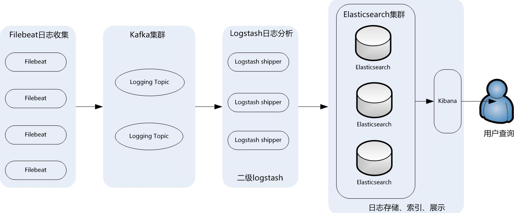

ELK是一个应用套件，由**Elasticsearch**、**Logstash**和**Kibana**三部分组件组成，简称ELK。它是一套开源免费、功能强大的日志分析管理系统。ELK可以将我们的系统日志、网站日志、应用系统日志等各种日志进行收集、过滤、清洗，然后进行集中存放并可用于实时检索、分析。
<!--more-->
为了保证ELK收集日志的安全性和稳定性，此架构引入了消息队列机制，采用**KAFKA**集群实现消息队列。并在前端使用**Filebeat**收集日志，有效降低了收集日志对业务系统资源的消耗。

**架构**



## 安装ELK集群
### 一、软件版本

**系统环境：** Centos7

下面是需要的软件包，从各自官网下载：

- elasticsearch-7.5.1-linux-x86_64.tar.gz
- logstash-7.5.1.tar.gz
- kibana-7.5.1-linux-x86_64.tar.gz
- filebeat-7.5.1-linux-x86_64.tar.gz
- kafka_2.12-2.4.0.tgz
- GeoLite2-City_20191231.tar.gz
- jdk-11.0.4_linux-x64_bin.tar.gz

### 二、实验架构
**ELK系统**： 安装elasticsearch、logstash、kibana、kafka，在内网一台服务器上安装。
**应用系统**：安装filebeat收集nginx的访问日志，公网生产服务器。

我们这里使用ELK系统来分析nginx的log日志。

### 三、安装步骤
#### 1、配置JDK环境
elasticsearch-7.5.1要求jdk11版本，elasticsearch-7.5.1软件包本身集成了openjdk11，可以不单独安装JDK环境，但是我们实验环境整个ELK架构都安装在同一台机器上，其他软件包也需要JDK，因此单独配置JDK环境。
配置过程略。

#### 2、安装Elasticsearch

**前提：Centos7系统基础配置**

1、Linux资源使用配置文件   */etc/security/limits.conf*

```
* soft nofile 65536 #警告设定所有用户最大打开文件数为65535
* hard nofile 65536 #严格设定所有用户最大打开文件数为65535
* soft nproc 2048 #警告设定所有用户最大打开进程数为2048
* hard nproc 4096 #严格设定所有用户最大打开进程数为2048

#因为es配置文件里设置锁住swapping，因此需要如下设置
es soft memlock unlimited #警告设定es用户最大锁定内存地址空间为无限制
es hard memlock unlimited #严格设定es用户最大锁定内存地址空间为无限制
```

2、Linux系统控制文件   */etc/sysctl.conf* 

```
vm.max_map_count=655360  # 限制进程可以拥有的VMA(虚拟内存区域)的数量
fs.file-max=655360       # 设置系统进程一共可以打开的文件数量
```


A、新建用户es，elastchsearch不允许root权限直接运行

```shell
[root@KCUVJb2c ~]# useradd es
```

B、解压elasticsearch-7.5.1-linux-x86_64.tar.gz软件包到普通用户es宿主目录/home/es，并授权es用户：

```shell
[root@KCUVJb2c src]# tar xvf elasticsearch-7.5.1-linux-x86_64.tar.gz -C /home/es/
[root@KCUVJb2c ~]# chown -R es.es /home/es/elasticsearch-7.5.1/
```

C、修改配置文件elasticsearch-7.5.1/config/elasticsearch.yml

从7.0开始es废弃了原来的zen discovery配置项，引入了新的"cluster.initial_master_nodes"配置项。

```shell
node.name: node-1                # 节点名称
path.data: /data/elastic_data    # 更改数据存放目录
network.host: 0.0.0.0            # 侦听地址
http.port: 9200                  # 侦听端口
discovery.seed_hosts: ["127.0.0.1", "[::1]"]  # 默认配置
cluster.initial_master_nodes: ["node-1"]      # 指定master节点
```

D、启动elasticsearch

```shell
[es@KCUVJb2c ~]$ elasticsearch-7.5.1/bin/elasticsearch -d
```

#### 3、安装KAFKA
KAFKA作为消息队列负责接收生产服务器发送过来的日志数据，我们的ELK环境部署在公司内网服务器上，通过出口路由器做端口映射，路由器上配置有静态公网IP地址，生产服务器向出口IP+端口发送数据。
假设
**内网elk IP**：     192.168.1.220:9092
**路由器IP地址**：125.90.92.31:9092
由于KAFKA只能侦听所在机器的IP+端口。
我们在测试时，生产服务器上的filebeat向路由器公网IP 125.90.92.31:9092发送数据时会出错：
*提示连接 192.168.1.220:9092超时*

*解决办法：*

*1、在KAFKA服务器添加host： 192.168.1.220	kafka.domain.com*

​      *在生产服务器添加host： 125.90.92.31 kafka.domain.com*

*2、在KAFKA配置文件修改侦听地址： listeners=PLAINTEXT://kafka.domain.com:9092

​      *生产服务器filebeat配置文件里，KAFKA的推送地址为 kafka.domain.com:9092


##### **安装步骤**

A、解压kafka_2.12-2.4.0.tgz软件包到指定目录

```shell
[root@tbmMBazV ~]# tar xvf kafka_2.12-2.4.0.tgz -C /usr/local/
```

B、启动zookeeper集群，kafka软件包里默认基础了zookeeper，我们启动一个单点集群，配置文件保持默认：

```shell
[root@tbmMBazV kafka_2.12-2.4.0]# bin/zookeeper-server-start.sh -daemon config/zookeeper.properties 
```

C、修改kafka配置文件 *kafka_2.12-2.4.0/config/server.properties* ，其他配置保持默认：

```shell
broker.id=1   # 每一个broker在集群中的唯一标示
listeners=PLAINTEXT://kafka.emobistudio.com:9092   # 侦听地址及端口
message.max.bytes=100000000     #消息体的最大大小，单位是字节
```

D、启动KAFKA

```shell
[root@tbmMBazV kafka_2.12-2.4.0]# bin/kafka-server-start.sh -daemon config/server.properties 
```


##### **KAFKA相关命令**

创建topic

```shell
bin/kafka-topics.sh --create --zookeeper localhost:2181 --replication-factor 1 --partitions 60 --topic topic_name
```

查看所有topic

```shell
bin/kafka-topics.sh --list --zookeeper localhost:2181
```

查看某个topic具体信息

```shell
bin/kafka-topics.sh --describe --zookeeper localhost:2181 --topic topic_name
```

删除topic

```shell
bin/kafka-topics.sh --delete --zookeeper localhost:2181 --topic topic_name
```

生产消息

```shell
bin/kafka-console-producer.sh --broker-list 192.168.1.220:9092 --topic topic_name
```

消费消息

```shell
bin/kafka-console-consumer.sh --bootstrap-server 192.168.1.220:9092 --topic topic_name--from-beginning
```


##### **配置步骤**

创建topic，以接收存储生成服务器filebeat发过来的log数据：

```shell
bin/kafka-topics.sh --create --zookeeper localhost:2181 --replication-factor 1 --partitions 60 --topic awsnginx
```

logstash从此处消费数据。

#### 4、安装Logstash

Logstash从KAFKA队列中消费数据并存储到Elasticsearch中

A、解压logstash-7.5.1.tar.gz软件包到指定目录

```shell
[root@KCUVJb2c src]# tar xvf logstash-7.5.1.tar.gz -C /usr/local/
```

B、从GeoLite2-City_20191231.tar.gz包中提取IP解析库到logstash目录

GeoLite2-City.mmdb

C、构建配置文件 d.conf

下面是我生产环境的的配置文件：

```
input {
    kafka {
        bootstrap_servers => ["192.168.1.220:5044"]
        topics => ["log172","awsnginx"]
        codec => json
    }
}
filter {

    if [fields][logtypes] in ["nginx-access","vpn-nginx-access","sleep-nginx-access"] {

    		grok {
        		match => [
            	  		"message","%{IPORHOST:[nginx][access][remote_ip]} - %{DATA:[nginx][access][user_name]} \[%{HTTPDATE:[nginx][access][time]}\] \"%{WORD:[nginx][access][method]} %{DATA:[nginx][access][url]} HTTP/%{NUMBER:[nginx][access][http_version]}\" %{NUMBER:[nginx][access][response_code]} %{NUMBER:[nginx][access][body_sent][bytes]} \"%{DATA:[nginx][access][referrer]}\" \"%{DATA:[nginx][access][agent]}\" \"%{DATA:[nginx][access][forward]}\" %{NUMBER:[nginx][access][request_time]} \"%{NUMBER:no}, %{NUMBER:[nginx][access][upstream_response_time]}\"",
            	  		"message","%{IPORHOST:[nginx][access][remote_ip]} - %{DATA:[nginx][access][user_name]} \[%{HTTPDATE:[nginx][access][time]}\] \"%{WORD:[nginx][access][method]} %{DATA:[nginx][access][url]} HTTP/%{NUMBER:[nginx][access][http_version]}\" %{NUMBER:[nginx][access][response_code]} %{NUMBER:[nginx][access][body_sent][bytes]} \"%{DATA:[nginx][access][referrer]}\" \"%{DATA:[nginx][access][agent]}\" \"%{DATA:[nginx][access][forward]}\" %{NUMBER:[nginx][access][request_time]} \"%{NUMBER:[nginx][access][upstream_response_time]}\"",
				"message","%{IPORHOST:[nginx][access][remote_ip]} - %{DATA:[nginx][access][user_name]} \[%{HTTPDATE:[nginx][access][time]}\] \"%{WORD:[nginx][access][method]} %{DATA:[nginx][access][url]} HTTP/%{NUMBER:[nginx][access][http_version]}\" %{NUMBER:[nginx][access][response_code]} %{NUMBER:[nginx][access][body_sent][bytes]} \"%{DATA:[nginx][access][referrer]}\" \"%{DATA:[nginx][access][agent]}\" \"%{DATA:[nginx][access][forward]}\" %{NUMBER:[nginx][access][request_time]}"
        		]
		  	remove_field => "message"
    		}

		mutate {
		  add_field => { "read_timestamp" => "%{@timestamp}" }
                  convert => ["[nginx][access][request_time]", "float"]
                  convert => ["[nginx][access][upstream_response_time]", "float"]
		}

		date {
		  match => [ "[nginx][access][time]", "dd/MMM/YYYY:H:m:s Z" ]
		  remove_field => "[nginx][access][time]"
		}
		
		useragent {
			source => "[nginx][access][agent]"
			target => "[nginx][access][user_agent]"
			remove_field => "[nginx][access][agent]"
		}
		
		geoip {
		  database => "/usr/local/logstash-7.5.1/GeoLite2-City.mmdb"
		  source => "[nginx][access][remote_ip]"
		  target => "[nginx][access][geoip]"
		}

    } 


    else if [fields][logtypes] in ["nginx-error","vpn-nginx-error","sleep-nginx-error"] {

		grok {
			match => ["message","%{DATA:[nginx][error][time]} \[%{DATA:[nginx][error][level]}\] %{NUMBER:[nginx][error][pid]}#%{NUMBER:[nginx][error][tid]}: (\*%{NUMBER:[nginx][error][connection_id]} )?%{GREEDYDATA:[nginx][error][message]}(?:, client: (?<client_ip>%{IP}))(?:, server: %{IPORHOST:server}?)(?:, request: \"%{WORD:[nginx][error][verb]} %{URIPATHPARAM:[nginx][error][request]} HTTP/%{NUMBER:[nginx][error][http_version]}\")?"]
			
			#match => ["message","%{DATA:[nginx][error][time]} \[%{DATA:[nginx][error][level]}\] %{NUMBER:[nginx][error][pid]}#%{NUMBER:[nginx][error][tid]}: (\*%{NUMBER:[nginx][error][connection_id]} )?%{GREEDYDATA:[nginx][error][message]}"]
			
			remove_field => "message"
		}
    
		mutate {
		  rename => { "@timestamp" => "read_timestamp" }
		  remove_field => "server"
		}
    
		date {
		  match => [ "[nginx][error][time]", "YYYY/MM/dd H:m:s" ]
		  remove_field => "[nginx][error][time]"
		}
		
		geoip {
		  database => "/usr/local/logstash-7.5.1/GeoLite2-City.mmdb"
		  source => "client_ip"
		  target => "[nginx][error][geoip]"
		}
	
    }
	
	else if [fields][logtypes] == "shadowsocks" {
	
	    grok {
		    match => ["message","(?<timestamp>^\d{4}(-\d\d){2} \d\d(:\d\d){2}) %{DATA:[ss][level]} \s+%{GREEDYDATA:[ss][message]}"]
			remove_field => "message"
		}
		
		date {
			match => [ "timestamp", "YYYY/MM/dd H:m:s" ]
			remove_field => "timestamp"
		}
		
	}

}

output {

	if [fields][logtypes] in ["nginx-access", "nginx-error"] {
	
		elasticsearch {
			hosts => ["127.0.0.1:9200"]
			index => "vpn-balance"
                        user => "elastic"
                        password => "123456"
		}
		stdout {codec => rubydebug}
	
	}
	
	else if [fields][logtypes] == "shadowsocks" {
		elasticsearch {
			hosts => ["127.0.0.1:9200"]
			index => "shadowsocks"
                        user => "elastic"
                        password => "123456"
		}
		stdout {codec => rubydebug}
	}
	
	else if [fields][logtypes] in ["vpn-nginx-access", "vpn-nginx-error"] {
	
		elasticsearch {
			hosts => ["127.0.0.1:9200"]
			index => "vpn-api"
                        user => "elastic"
                        password => "123456"
		}
		stdout {codec => rubydebug}
	
	}


	else if [fields][logtypes] in ["sleep-nginx-access", "sleep-nginx-error"] {
	
		elasticsearch {
			hosts => ["127.0.0.1:9200"]
			index => "sleep-api"
                        user => "elastic"
                        password => "123456"
		}
		stdout {codec => rubydebug}
	
	}
	
}
```

D、启动Logstash

```shell
[root@KCUVJb2c logstash-7.5.1]# nohup bin/logstash -f d.conf &
```
#### 5、安装Kibana
Kibana主要用来检索分析展示Elasticsearch中的数据

A、解压kibana-7.5.1-linux-x86_64.tar.gz软件包到指定目录

```shell
[root@KCUVJb2c src]# tar xvf kibana-7.5.1-linux-x86_64.tar.gz -C /usr/local/
```

B、修改配置文件 *kibana-7.5.1-linux-x86_64/config/kibana.yml*

```shell
server.port: 5601       # 侦听端口
server.host: "0.0.0.0"  # 侦听地址
elasticsearch.hosts: ["http://192.168.1.219:9200"]  # elastcisearch地址
# 下面用户名密码是启用xpack认证后需要配置的
elasticsearch.username: "elastic"
elasticsearch.password: "123456"
```

C、启动Kibana

Kibana默认情况不允许root权限直接启动，若要root启动添加--allow-root参数

```shell
[root@KCUVJb2c kibana-7.5.1-linux-x86_64]# nohup bin/kibana --allow-root &
```
#### 6、安装Filebeat
Filebeat安装在生产服务器上，把生产服务器的log文件推送到KAFKA消息队列。

前提：Kafka安装步骤那里有说明。

添加hosts： 125.90.92.31 kafka.domain.com

A、解压filebeat-7.5.1-linux-x86_64.tar.gz软件包到指定路径

```shell
[root@KCUVJb2c src]# tar xvf filebeat-7.5.1-linux-x86_64.tar.gz -C /usr/local/
```

B、修改配置文件 *filebeat-7.5.1-linux-x86_64/filebeat.yml*

```
filebeat.inputs:
- type: log
  enabled: true
  paths:
    - /var/log/nginx/api-access*
  document_type: "nginx"
  fields:
    logtypes: nginx-access
    logserver: 35.182.34.224

- type: log
  enabled: true
  paths:
    - /var/log/nginx/api-error*
  document_type: "nginx"
  fields:
    logtypes: nginx-error
    logserver: 35.182.34.224

setup.kibana:
#--------------------------- Kifka output -------------------------------
output.kafka:
  enable: true
  hosts: ["kafka.domain.com:9092"]
  topic: awsnginx
  max_message_bytes: 100000000
```

C、启动Filebeat

```shell
nohup /usr/local/filebeat-6.5.4-linux-x86_64/filebeat -c /usr/local/filebeat-6.5.4-linux-x86_64/filebeat.yml &
```


## 配置nginx log

nginx配置文件的默认log格式如下：

```nginx
http {
	log_format  main  '$remote_addr - $remote_user [$time_local] "$request" '
                      '$status $body_bytes_sent "$http_referer" '
                      '"$http_user_agent" "$http_x_forwarded_for"';
    }
```

我们增加 $request_time 和$upstream_response_time字段，配置如下：

```nginx
http {
    log_format  my_timed  '$remote_addr - $remote_user [$time_local] "$request" '
                          '$status $body_bytes_sent "$http_referer" '
                          '"$http_user_agent" "$http_x_forwarded_for" $request_time "$upstream_response_time"';
}
```

具体server下使用自定义的my_timed 日志格式

```nginx
access_log /var/log/nginx/topvpn-access.log my_timed;
error_log   /var/log/nginx/topvpn-error.log warn;
```

在Logstash配置文件里，根据这个格式解析具体的字段内容，存储到Elasticsearch。


本文相关配置文件示例传送门github。